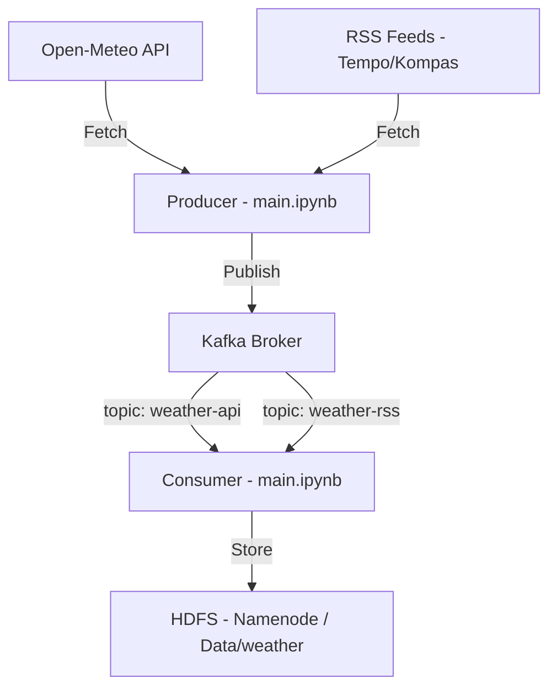

# WeatherPulse - Big Data Weather Pipeline

WeatherPulse is a real-time data pipeline designed to ingest, process, and store weather information from multiple sources. This project leverages **Apache Kafka** for reliable messaging and **Apache Hadoop (HDFS)** for persistent storage of large-scale weather datasets.

## Architecture



## Features

- **Real-time API Ingestion**: Monitors weather conditions (temperature, humidity, wind speed) for 6 major Indonesian cities (Jakarta, Surabaya, Semarang, Medan, Makassar, Denpasar).
- **RSS Feed Integration**: Scrapes weather-related news from national news outlets.
- **Message Queuing**: Uses Kafka to decouple data ingestion from storage logic.
- **Distributed Storage**: Automatically flushes ingested data into Hadoop HDFS for future analysis.
- **Dockerized Infrastructure**: Complete setup using Docker Compose for easy deployment.

##  Repository Structure

- `hadoop/`: Docker configuration and setup scripts for the Hadoop cluster (Namenode, Datanode, ResourceManager, NodeManager).
- `kafka/`: Docker configuration for the Kafka broker and controller.
- `main.ipynb`: Core Python logic containing producers, consumers, and data formatting.

##  Prerequisites

- Docker & Docker Compose
- Python 3.x
- Jupyter Notebook
- Python libraries: `kafka-python`, `requests`, `feedparser`

##  Getting Started

### 1. Launch Infrastructure

Ensure your Docker daemon is running, then start the services:

```bash
# Start Hadoop cluster
cd hadoop
docker-compose up -d

# Start Kafka broker
cd ../kafka
docker-compose up -d
```

### 2. Configuration & Initialization

Run the setup scripts to initialize Kafka topics and HDFS directories. 
> [!NOTE]
> There is a slight folder naming discrepancy in the setup scripts; follow these exact commands:

```bash
# Initialize Kafka topics (located in hadoop/ folder)
cd ../hadoop
bash hadoop_setup.sh

# Initialize HDFS directories (located in kafka/ folder)
cd ../kafka
bash kafka_setup.sh
```

### 3. Run the Pipeline

Open `main.ipynb` in your Jupyter environment and run the cells sequentially:
1.  **Section 1 (Data Source)**: Connects to APIs and RSS feeds.
2.  **Section 2 (Data Ingest)**: Starts threads to push data into Kafka.
3.  **Section 3 (Data Store)**: Starts consumers to save data into HDFS.

##  Data Locations

- **HDFS API Data**: `/data/weather/api/`
- **HDFS RSS Data**: `/data/weather/rss/`


# 5. DASHBOARD

Dashboard ini bertujuan untuk membangun sistem data pipeline yang menggabungkan:
- Data streaming (real-time) dari Kafka
- Data batch hasil analisis Spark
- Dashboard sederhana menggunakan Flask

Output akhir berupa dashboard web yang menampilkan data historis dan data live.

### Arsitektur Sistem

Sistem terdiri dari beberapa komponen utama:

1. Producer → Mengirim data ke Kafka
2. Kafka → Message broker
3. Consumer → Mengambil data dan menyimpan ke JSON
4. Spark → Analisis data historis
5. Flask Dashboard → Menampilkan data ke user

### Cara Menjalankan Sistem

Untuk menjalankan sistem ini secara keseluruhan, diperlukan beberapa terminal yang berjalan secara bersamaan.

#### 1. Menjalankan Producer API (Data Cuaca)
Buka terminal pertama dan jalankan:
```python producer_api.py```

Producer ini akan mengirim data cuaca ke Kafka secara real-time.

#### 2. Menjalankan Producer RSS (Data Berita)
Buka terminal kedua dan jalankan:
```python producer_rss.py```

Producer ini akan mengirim data berita terbaru ke Kafka.

#### 3. Menjalankan Dashboard (Flask)
Buka terminal ketiga dan jalankan:
```python app.py```

Kemudian buka browser dan akses:
http://localhost:5000

Dashboard akan menampilkan data historis dan data live.

#### Hasil Akhir
Setelah semua komponen berjalan:
- Dashboard akan menampilkan data dari Spark (historis)
- Data live akan terus diperbarui dari Kafka
- Halaman akan auto-refresh setiap 30 detik


---
*Created as part of the Big Data course (ETS-BD-5-A)*
